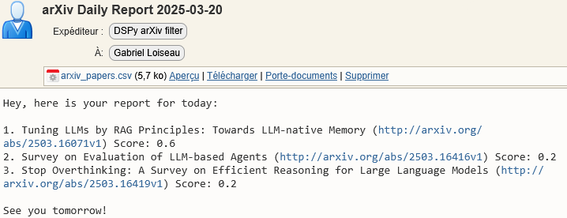

[ArXiv](https://arxiv.org/) serves as an invaluable resource for accessing cutting-edge research papers, but its volume can be [overwhelming](https://arxiv.org/stats/monthly_submissions). With hundreds of new papers published daily across various domains, staying up-to-date in your specific research area quickly becomes time consuming.

For example, popular categories like [cs.AI](https://arxiv.org/list/cs.AI/recent) (Artificial Intelligence) or [cs.CL](https://arxiv.org/list/cs.CL/recent) (Computation and Language) regularly publish 50-100 papers daily. Thoroughly evaluating these titles and abstracts demands a time commitment few researchers can realistically maintain.

In this post, we will create a simple automated arXiv filtering system powered by modern language models through DSPy. Our solution will automatically curate research papers aligned with your specific interests, helping you save precious time while ensuring you don't overlook critical developments in your field.

The complete implementation requires just three core components:

```bash
pip install dspy pandas arxiv
```

## ArXiv paper retrieval

The first step is to retrieve the most recent papers from arXiv. We'll use the official arXiv API through the [arxiv Python library](https://pypi.org/project/arxiv/):

```python
import arxiv

client = arxiv.Client()
search = arxiv.Search(
    query=f"cat:cs.CL",
    max_results=200,
    sort_by=arxiv.SortCriterion.SubmittedDate
)

results = client.results(search)
```
This configuration fetches up to 200 recent papers from the *Computation and Language* category. You can easily customize this to your research interests by substituting other category codes such as cs.AI, cs.CV, or any other [arXiv category](https://arxiv.org/category_taxonomy). Once retrieved, you can iterate through the results to extract essential information including paper URLs, titles, abstracts, and author details.

## LLM-based relevance scoring

We'll now build the core of our filtering system using [DSPy](https://dspy.ai/), a powerful framework for creating easy to use programs with LLMs. DSPy allows us to define structured interactions with language models without writing complex prompts manually.

First, let's define our relevance predictor using DSPy. The library allows us to explicitly write the behavior we want for our language models through a `dspy.Signature` object, we can then instanciate our signature in a dspy module (i.e. `dspy.Predict()`), and obtain a fully functionnal program.

```python
import dspy

class ArXivFilter(dspy.Signature):
    """Evaluate the relevance of an arXiv paper based on specified research interests."""
    research_keywords: str = dspy.InputField()
    paper_title: str = dspy.InputField()
    paper_abstract: str = dspy.InputField()

    relevance_score: float = dspy.OutputField()

# Create a predictor based on our signature
predictor = dspy.Predict(ArXivFilter)
```

Next, we need to configure the language model that will perform the prediction. DSPy supports various LLM providers, including local models via [ollama](https://ollama.com/) and API-based models. In our example, we will use [Gemini-2.0-Flash](https://openrouter.ai/google/gemini-2.0-flash-001) through the [OpenRouter API](https://openrouter.ai/):

```python
import os
# Set up your API key
os.environ["OPENROUTER_API_KEY"] = "your-api-key-here"

# Initialize the language model
lm = dspy.LM(
    'openrouter/google/gemini-2.0-flash-001', 
    api_base="https://openrouter.ai/api/v1"
)

# Configure DSPy to use this language model
dspy.configure(lm=lm)
```
The program consumes credits incrementally as it utilizes an openrouter model. To reduce overall budget requirements, you can downsize the model, host it locally, or—for minimal usage—leverage models with a free version (i.e., `google/gemma-3-12b-it:free`) with 200 daily request limit.
We can verify that our pipeline is working by taking a known relevant and irrelevant paper and compare our program output:
```python
KEYWORDS = "Privacy-preserving NLP, Text anonymization, LLM Memorization"

# Privacy-Preserving Large Language Models: Mechanisms, Applications, and Future Directions
# https://arxiv.org/abs/2412.06113 
relevant_paper = next(arxiv.Client().results(arxiv.Search(id_list=["2412.06113"])))
pred = predictor(
    research_keywords=KEYWORDS,
    paper_title=relevant_paper.title,
    paper_abstract=relevant_paper.summary
)
print("Score:",pred.relevance_score)
## Score: 0.95

# A Review on Large Language Models for Visual Analytics
# https://arxiv.org/abs/2503.15176
not_relevant_paper = next(arxiv.Client().results(arxiv.Search(id_list=["2503.15176"])))
pred = predictor(
    research_keywords=KEYWORDS,
    paper_title=not_relevant_paper.title,
    paper_abstract=not_relevant_paper.summary
)
print("Score:",pred.relevance_score)
## Score: 0.2
```

Now we can process papers and evaluate their relevance:

```python
from datetime import date, timedelta
import pandas as pd

data = []
yesterday = date.today() - timedelta(days=1)

for r in results:
  # Only analyze papers from the previous day
  if not str(r.published.date()) == str(yesterday.strftime('%Y-%m-%d')): continue

  classification = predictor(
      research_keywords=KEYWORDS,
      paper_title=r.title,
      paper_abstract=r.summary)

  score = classification.relevance_score
  data += [dict(url=r.entry_id, title=r.title, score=score)]

df = pd.DataFrame(data).sort_values('score',ascending=False)
# Save the final table 
df.to_csv("arxiv_papers.csv")
```

The resulting table contains all papers released yesterday, ranked by their relevance score.
|    | URL                                | Title                                                                                             | Score |
|----|------------------------------------|---------------------------------------------------------------------------------------------------|-------|
| 19 | [arXiv:2503.16071v1](http://arxiv.org/abs/2503.16071v1) | Tuning LLMs by RAG Principles: Towards LLM-native Memory                     |  0.6  |
|  2 | [arXiv:2503.16416v1](http://arxiv.org/abs/2503.16416v1) | Survey on Evaluation of LLM-based Agents                                     |  0.2  |
|  1 | [arXiv:2503.16419v1](http://arxiv.org/abs/2503.16419v1) | Stop Overthinking: A Survey on Efficient Reasoning for Large Language Models |  0.2  |
|... | ...                                                     | ...                                                                          |  ...  |
| 45 | [arXiv:2503.15783v1](http://arxiv.org/abs/2503.15783v1) | Grammar and Gameplay-aligned RL for Game Description Generation with LLMs    |  0    |


## Send results via email

Once we have our relevance-scored papers, we can generate a report and send it to ourselves. To this end, you can use external tools such as [pushbullet](https://www.pushbullet.com/) or [SendGrid](https://sendgrid.com/en-us). In our case, we will use python built-in email libraries to send a daily email to our main email address. 

```python
import smtplib
import imaplib
import ssl
import time
from email.mime.multipart import MIMEMultipart
from email.mime.text import MIMEText
from email.mime.application import MIMEApplication
from email.utils import formatdate

USER = "your-username"
PASSWORD = "your-password"

# Define email content
from_addr = "your-recipient-address"
to_addr = "your-reciever-address"
subject = f"arXiv Daily Report {str(yesterday.strftime('%Y-%m-%d'))}"

report_sample = "\n".join([" ".join([f"{i+1}.", tup.title, f"({tup.url})", f"Score: {tup.score}"]) for i, tup in enumerate(df.head(3).itertuples())])
body = f"""Hey, here is your report for today:

{report_sample}

See you tomorrow!"""

# Create the message properly from scratch
msg = MIMEMultipart()
msg['From'] = f"DSPy arXiv filter <{from_addr}>"
msg['To'] = f"your-name <{to_addr}>"
msg['Subject'] = subject
msg['Date'] = formatdate(localtime=True)

# Attach the body
msg.attach(MIMEText(body, 'plain', 'utf-8'))

with open(file="arxiv_papers.csv", mode="rb") as f:
    attch = MIMEApplication(
        f.read(),
        _subtype="csv",
        Name="arxiv_papers.csv"
    )

    attch.add_header(
        "Content-Disposition",
        "attachment",
        filename="arxiv_papers.csv"
    )

    attch.add_header(
        "Content-ID",
        "arxiv_papers"
    )

msg.attach(attch)

# Send email
context = ssl.create_default_context()
imap = imaplib.IMAP4_SSL("your-imap-address", 993) # Also ajust the port
imap.login(USER, PASSWORD)

with smtplib.SMTP_SSL(
        host="your-smtp-address",
        port=465, # Same here for smtp
        context=context
) as s:
    s.login(USER, PASSWORD)
    s.sendmail(msg["From"], msg["To"], msg.as_string())
    imap.append('Sent', '\\Seen', imaplib.Time2Internaldate(time.time()), msg.as_string().encode("utf-8"))

imap.logout()
```

By now, you should have received your email containing the top 3 papers selected for today, along with the full results table attachment (which can be helpful for debugging purposes).



## Conclusion
DSPy enables the rapid development of efficient language processing programs, requiring just a few lines of Python code to implement a complete prediction pipeline. Our pipeline is highly customizable and can be enhanced in various ways. You can incorporate multiple LM programs to address additional aspects of paper filtering (such as filtering by authors or paper content), and leverage other DSPy modules like `dspy.ChainOfThought()` to generate reasoning strings that visualize the factors influencing model decisions.
